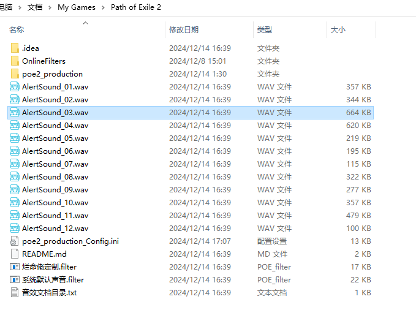
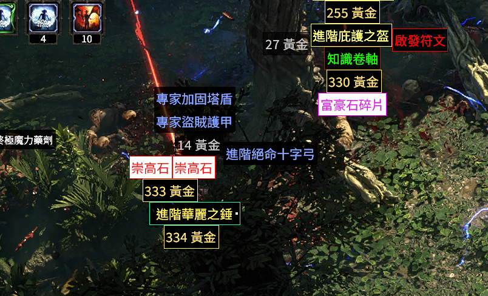

# PoE2-Filter
Path of Exile (PoE) 2 的基础滤镜，在等待 NeverSink 完成他的版本期间使用。
## [下载链接](https://github.com/mathon654/POE2-filter/releases)

## 使用说明
- 关闭迅游简体中文，要不然会报错
- 新用户下载整体包内容 [下载链接](https://github.com/mathon654/POE2-filter/releases)
- 老用户可以直接下载定制内容 [下载链接](https://github.com/mathon654/POE2-filter/blob/main/%E7%83%82%E5%91%BD%E4%BD%AC%E5%AE%9A%E5%88%B6.filter)下载文件替换即可

## 安装方法
- 游戏内：按 ESC -> 选项 -> 游戏选项卡 -> 文件夹图标
- 解压下载的文件
- 将解压后的文件夹放入文件夹中
- 
- 游戏内：在下拉菜单中选择 烂命佬定制 或者 系统默认声音 并在游戏内点击刷新。  
- 如果没有提示重启游戏

- 

## 功能介绍
- 提供系统音效和烂命佬定制音效两种,
- 增加了召唤权杖的强提示
- 增加了高级品质白装和打孔装备的强提示
- 高品质可以去回收成提升品质的通货
- 打孔装备可以回收成工匠石碎片
- 可以自定义音效
- 默认音效为烂命佬的音效

## 定制音效

### 第一种方法
- 在 `自定义掉落音效素材库` 文件夹中选择想要的音效
- 复制到文件中覆盖当前音效即可

### 第二种方法
- 下载你想定制的音效wav文件
- 重命名为对应的名称即可

## 修改内容
